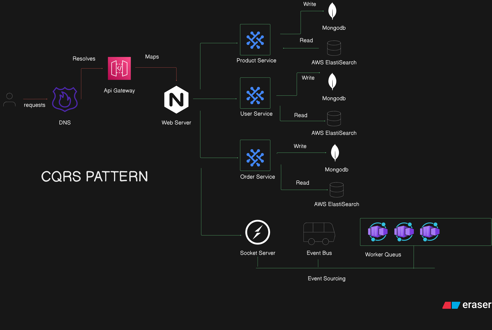

# CQRS Application System Design

This repository contains a Node.js application built following the CQRS (Command Query Responsibility Segregation) pattern with a microservices architecture. It demonstrates a modern, scalable system design approach for building complex applications with separate read and write concerns.

## Architecture Overview



### What is CQRS?

CQRS (Command Query Responsibility Segregation) is an architectural pattern that separates read and write operations into different models:

- **Commands**: Handle write operations (create, update, delete)
- **Queries**: Handle read operations (get, list, search)

This separation allows for independent optimization of the read and write paths, enabling:

- Different database technologies optimized for specific operations
- Better scalability by scaling read and write sides independently
- Improved performance through specialized data models
- Enhanced security with different permission models

### Key Components

- **CQRS Pattern**: Separates read (Query) and write (Command) operations
- **Event Sourcing**: Stores the complete history of state changes
- **Microservices**: Domain-driven services with separate concerns
- **API Gateway**: Central entry point for all client requests
- **Worker Processes**: For handling background tasks and asynchronous operations
- **Socket Server**: For real-time communications and updates
- **Security**: Implemented with Nginx, JWT, and best practices
- **Containerization**: Using Docker for consistent deployment
- **Database Separation**: MongoDB for write operations, Redis for read operations

## Folder Structure

- `/api-gateway`: API Gateway service (Express.js) for routing requests to appropriate microservices
- `/services`: Contains all domain microservices
  - `/user-service`: User management service with authentication and authorization
  - `/order-service`: Order management service (planned)
  - `/product-service`: Product management service (planned)
  - `/payment-service`: Payment processing service (planned)
- `/workers`: Background job workers for asynchronous tasks
- `/socket-server`: Real-time communication server for instant updates
- `/nginx`: Nginx configuration for reverse proxy, load balancing, and security
- `/shared`: Shared libraries, utilities, DTOs, and common code
- `/docker`: Docker configuration files for containerization

## Getting Started

> **Note**: This project is currently under active development. Some features may be incomplete or subject to change.

### Prerequisites

- Node.js v16+ and npm
- Docker and Docker Compose (for containerized deployment)
- MongoDB (or MongoDB Atlas account)
- Redis (optional, for enhanced read performance)

### Setup Instructions

1. **Clone the repository**
   ```bash
   git clone https://github.com/sahil2832005/CQRS-Application-System-Design.git
   cd CQRS-Application-System-Design
   ```

2. **Install dependencies**
   ```bash
   # Install shared dependencies
   cd shared
   npm install
   cd ..

   # Install service dependencies
   cd services/user-service
   npm install
   cd ../..
   
   # Repeat for other services as they are developed
   ```

3. **Environment Setup**
   ```bash
   # Copy example environment files
   cp .env.example .env
   cp services/user-service/.env.example services/user-service/.env
   
   # Edit the .env files with your configuration values
   ```

4. **Start services (Development mode)**
   ```bash
   # Start user service
   cd services/user-service
   npm run dev
   ```

5. **Docker Deployment (Optional)**
   ```bash
   # Build and start all services
   docker-compose up -d
   ```

## Current Development Status

This project is **under active development**. The following components are currently being implemented:

- ✅ User Service with CQRS pattern
- ✅ MongoDB integration for write operations
- ✅ Redis integration for read operations
- ✅ JWT Authentication
- 🔄 API Gateway
- 🔄 Docker Containerization
- ⏳ Socket Server
- ⏳ Additional Microservices
- ⏳ Comprehensive Documentation

## Contribution

Contributions are welcome! Please feel free to submit a Pull Request.

## License

This project is licensed under the MIT License - see the LICENSE file for details.
